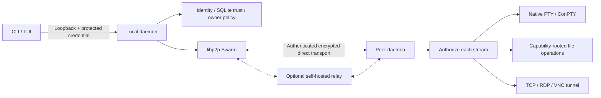

# Architecture

`opengate-security` owns local key storage and invitation tokens. `opengate-core` owns configuration and transactional trust. `opengate-protocol` owns bounded versioned framing. `opengate-network` owns discovery, encrypted transport, relay and reconnect tracking. Terminal, files and tunnel crates own already-authorized service streams. `opengate-service` owns visible OS lifecycle integration; `opengate-cli` binds these pieces together and provides the TUI.

The same daemon accepts incoming streams and opens outgoing streams. The local management channel is separate from the public libp2p listener. A private state-directory lock prevents simultaneous daemons from using one identity. Each remote stream negotiates a service protocol and sends an OpenRequest with an idempotency/replay identifier. Authentication checks the stored public identity and permissions before dispatch.

A cancellation token belongs to every active service. Revocation, permission changes, shutdown and transport failures cancel work; terminal cleanup must also run if the enclosing future is dropped. File checkpoints survive transport loss. Tunnels preserve backpressure but cannot resume arbitrary application TCP sessions safely.

Trust is directional even though the initial pairing exchanges both public identities. Relay/discovery observations are never inserted into the trust database as grants. Root/admin operation requires both installation-time owner capability and per-peer permission.
